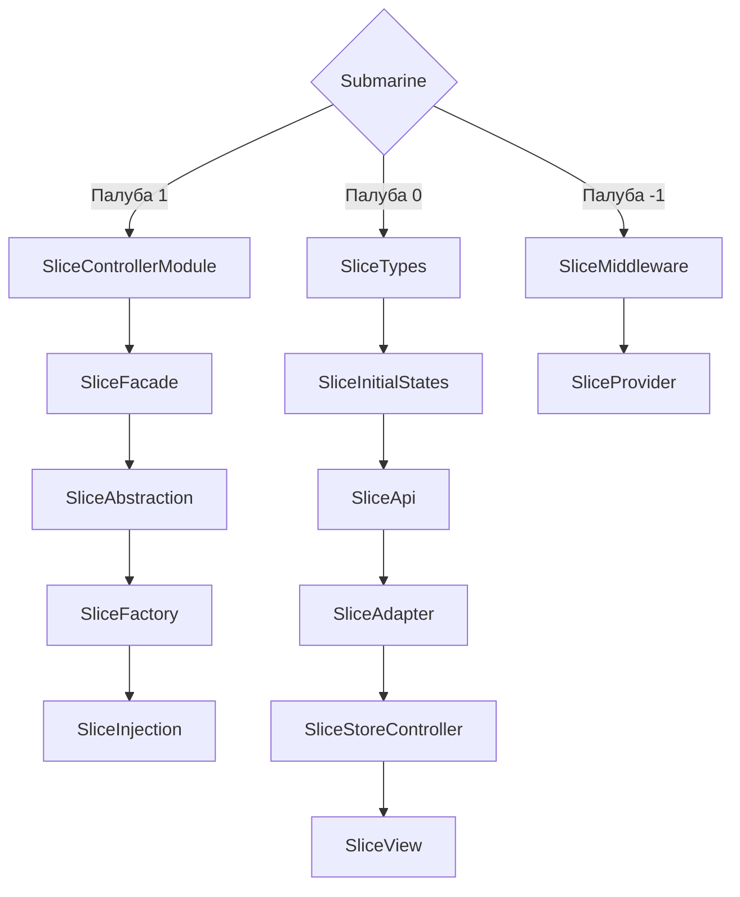

Standart names

prefix - state for states
const stateName = reactive/ref

prefix - action fro actions
const actionUpdateState = (payload) => Object.assign(stateName,payload)

1. SliceViewModuleName - (SliceTypesName + SliceInitialStatesName + SliceControllerName) + (SliceTypesName + SliceInitialStatesName + SliceControllerName) = SliceControllerModuleName
2. SliceControllerModuleName

https://codesandbox.io/p/devbox/36d2vl

БЛ - бизнес логика

### Палуба 1 
- SliceControllerModule - содержит БЛ из нескольких SliceController-ов
- SliceFacade - содержит БЛ по паттерну Фасад
- SliceFactory - содержит БЛ по паттерну Фабрика
- SliceAbstraction - для создание абстракции (это обобщение сложной логики за простым интерфейсом)

### Палуба 0
- SliceTypes - содержит типы данного слоя
- SliceInitialStates - содержит первоначальные состояния данного слоя, заглушки
- SliceApi - содержит чистые методы для получения API
- SliceAdapter - на данном слое можем производить различные агрегации с данными, применять адаптеры для данных
- SliceStoreController - данный слой предназначен для реализации БЛ
- SliceView - данный слой предназначен для отображения в UI, с минимум БЛ
- 
### Палуба -1
Архитектура подводной лодки/судна
- 1 палуба - 0 палуба - (-1 палуба)
| 1 отсек | 2 отсек | 3 отсек

