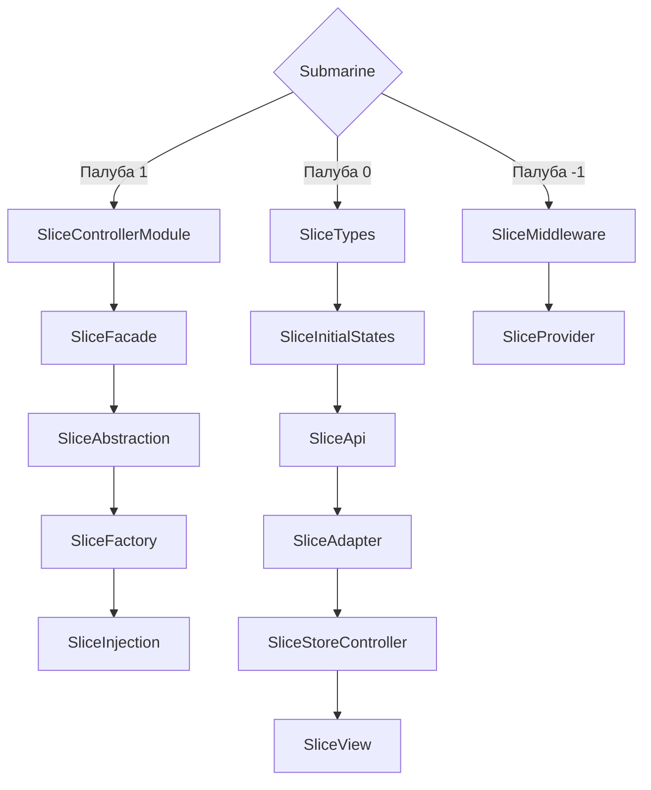

# Архитектура Aqua-Submarine

draft - https://codesandbox.io/p/devbox/36d2vl

#### Сокращения
БЛ - бизнес логика

## Стандарты неймингов
- prefix on/handler - обработчик, действие - function -> onClickButton, handlerScrollUp
- prefix is - boolean true/false example -> isSaveList
- prefix map - карта, объект {} example -> mapStatuses
- prefix list - массив [] example -> listServices
  
## Ценность 
1. Простота использования
2. Разделение Slices каждую зону ответственности, можно добавить легко новый слой и так же убрать
3. Скорость разработки фичи
4. Простота поддержки
5. Легкая интеграция

## Core concepts
1. Разделение на отсеки (как на подводной лодке / карабле) Если затопило 1 отсек, корабль функционирует и полноценно работает
2. Разделение на палубы(ярусы) 1, 0, -1
3. Похожа на модульную архитектуру, но делим на слои бизнес-логику

Последовательность Slices:
- Example - SliceTypesName --> SliceInitialStates --> SliceApiName --> SliceAdapterName --> SliceControllerName --> SliceViewName

```js
// для слоя SliceControllerName используем префиксы:

prefix - state for states
const stateName = reactive/ref

prefix - action fro actions
const actionUpdateState = (payload) => Object.assign(stateName,payload)
```

### Палуба 1 
- SliceControllerModule - содержит БЛ из нескольких SliceController (SliceTypesName + SliceInitialStatesName + SliceControllerName) + (SliceTypesName +     SliceInitialStatesName + SliceControllerName) = SliceControllerModuleName
- SliceFacade - содержит БЛ по паттерну Фасад
- SliceFactory - содержит БЛ по паттерну Фабрика
- SliceAbstraction - для создание абстракции (это обобщение сложной логики за простым интерфейсом)

### Палуба 0
- SliceTypes - содержит типы данного слоя
- SliceInitialStates - содержит первоначальные состояния данного слоя, заглушки
- SliceApi - содержит чистые методы для получения API
- SliceAdapter - на данном слое можем производить различные агрегации с данными, применять адаптеры для данных
- SliceStoreController - данный слой предназначен для реализации БЛ
- SliceView - данный слой предназначен для отображения в UI, с минимум БЛ
  
### Палуба -1
- SliceMiddleware - данный слой предназначен для перехвата данных, обработки, гвардов (используется после SliceAdapter и до SliceController)
- SliceProvider - данный слой предназначен для передачи данных, что лежит в данном слое(как единая точка входа) *** Эксперементально
  
Архитектура подводной лодки/судна
- 1 палуба - 0 палуба - (-1 палуба)
| 1 отсек | 2 отсек | 3 отсек




