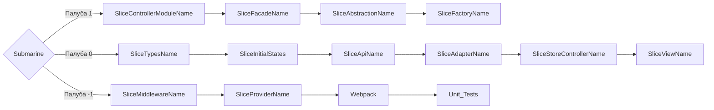

Standart names

prefix - state for states
const stateName = reactive/ref

prefix - action fro actions
const actionUpdateState = (payload) => Object.assign(stateName,payload)

1. SliceViewModuleName - (SliceTypesName + SliceInitialStatesName + SliceControllerName) + (SliceTypesName + SliceInitialStatesName + SliceControllerName) = SliceControllerModuleName
2. SliceControllerModuleName

https://codesandbox.io/p/devbox/36d2vl

Архитектура подводной лодки/судна
- 1 палуба - 0 палуба - (-1 палуба)
| 1 отсек | 2 отсек | 3 отсек

